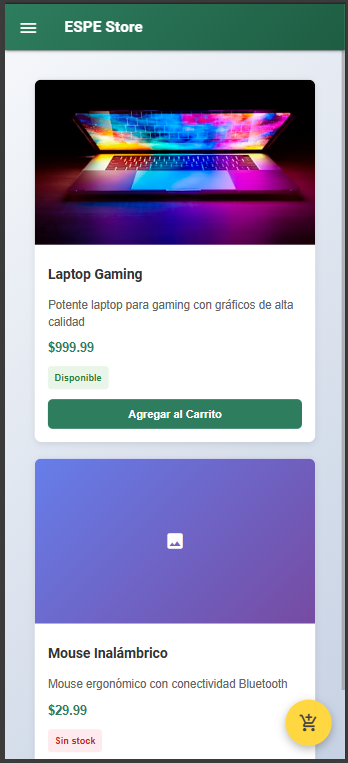
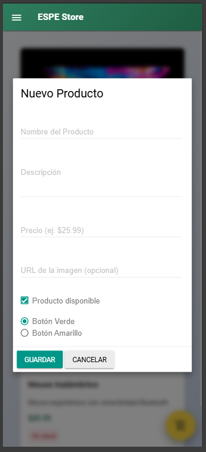
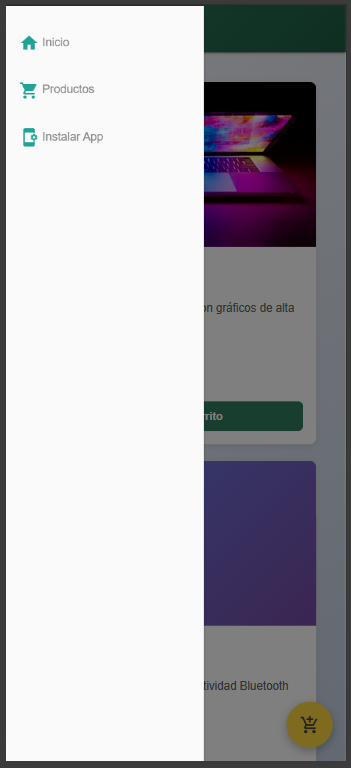
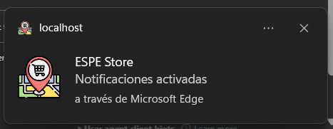

# ESPE Store - Progressive Web App (PWA) 🛒

Una aplicación web moderna para gestión de productos con capacidades PWA, diseñada con Material Design Lite y funcionalidad offline.


## ✨ Características

### 🚀 PWA (Progressive Web App)
- ✅ **Instalable** - Se puede instalar como aplicación nativa
- ✅ **Offline First** - Funciona sin conexión a internet
- ✅ **Service Worker** - Cache inteligente de recursos
- ✅ **Web App Manifest** - Configuración completa de PWA
- ✅ **Notificaciones Push** - Sistema de notificaciones integrado

### 🎨 Interfaz de Usuario
- ✅ **Material Design Lite** - Diseño moderno y responsivo
- ✅ **Responsive Design** - Optimizado para móvil y desktop
- ✅ **Animaciones Suaves** - Transiciones y efectos visuales
- ✅ **Toast Notifications** - Feedback visual para el usuario
- ✅ **Modal Interactivo** - Formulario deslizante para productos

### 🛍️ Gestión de Productos
- ✅ **Validación de Formularios** - Campos requeridos y validación
- ✅ **Estado de Stock** - Disponible/Sin Stock
- ✅ **Imágenes de Productos** - Soporte para URLs de imágenes
- ✅ **Temas de Botones** - Verde y amarillo personalizables

## 🌐 Demo

La aplicación está disponible en: [Demo en vivo](https://alexmig24.github.io/PWA_Showcase/)

## 🚀 Instalación

### Prerrequisitos
- Navegador web moderno (Chrome, Firefox, Edge, Safari)
- Servidor web local (opcional: Live Server, http-server, etc.)

### Pasos de Instalación

1. **Clonar o descargar el proyecto**
   ```bash
   git clone https://github.com/Alexmig24/PWA_Showcase.git
   cd PWA_Showcase
   ```

2. **Estructura de archivos necesaria**
   ```
   PWA_Showcase/
   ├── index.html
   ├── sw.js
   ├── manifest.json
   ├── src/
   │   ├── css/
   │   │   └── app.css
   │   └── js/
   │       └── app.js
   └── assets/
        └── icons/
            ├── icon-128x128.png
            ├── icon-256x256.png
            └── icon-512x512.png
   ```

3. **Iniciar servidor local**
   ```bash
   # Opción 1: Script Personalizado
   npm run serve
   
   # Opción 2: Node.js
   npx http-server
   ```

4. **Acceder a la aplicación**
   ```
   http://localhost:8000
   ```

## 🔧 Funcionalidades

### Gestión de Productos

#### Agregar Producto
```javascript
// Campos del formulario
- Nombre del Producto (requerido)
- Descripción (requerido)  
- Precio (requerido, formato: $XX.XX)
- URL de Imagen (opcional)
- Estado: Disponible/Sin Stock
- Tema del Botón: Verde/Amarillo
```

#### Visualización
- **Grid Responsivo**: Adaptable a diferentes tamaños de pantalla
- **Cards Dinámicas**: Creadas mediante JavaScript
- **Estado Visual**: Indicadores de stock y precios
- **Imágenes con Fallback**: Ícono por defecto si falla la imagen

### Carrito de Compras

#### Funcionalidades
```javascript
// Agregar producto al carrito
handleAddToCart(index)

// Guardar en LocalStorage
saveToCart(product)

// Estructura del carrito
{
  title: "Nombre del producto",
  price: "$XX.XX",
  quantity: number,
  addedAt: "ISO Date String",
  // ... otros campos del producto
}
```

## 🛠️ Tecnologías Utilizadas

### Frontend
- **HTML5** - Estructura semántica
- **CSS3** - Estilos y animaciones
- **JavaScript ES6+** - Lógica de aplicación
- **Material Design Lite** - Framework de UI

### PWA Technologies
- **Service Worker** - Cache y funcionalidad offline
- **Web App Manifest** - Configuración de instalación
- **Cache API** - Almacenamiento en cache
- **Notification API** - Notificaciones push

## ⚙️ Configuración PWA

### Service Worker (sw.js)
```javascript
// Cache Strategy: Cache First with Network Fallback
const CACHE_NAME = 'espe-store-v1';
const urlsToCache = [
  './',
  './index.html',
  './src/css/app.css',
  // ... más recursos
];
```

### Web App Manifest (manifest.json)
```json
{
  "name": "ESPE Store",
  "short_name": "ESPE Store",
  "start_url": "./",
  "display": "standalone",
  "theme_color": "#009688",
  "background_color": "#ffffff"
}
```

### Instalación PWA
El botón de instalación aparece automáticamente cuando:
- ✅ La aplicación se sirve sobre HTTPS (o localhost)
- ✅ Incluye un Web App Manifest válido
- ✅ Registra un Service Worker
- ✅ Cumple los criterios de instalabilidad de Chrome

## 📱 Uso

### Para Usuarios Finales

1. **Navegación**
   - Abrir el menú lateral con el botón ☰
   - Navegar entre secciones: Inicio, Productos

2. **Agregar Productos**
   - Clic en el botón flotante ➕
   - Completar el formulario modal
   - Guardar producto

3. **Gestionar Carrito**
   - Clic en "Agregar al Carrito" en cualquier producto
   - Ver notificaciones de confirmación
   - Los productos se guardan automáticamente

4. **Instalar como App**
   - Buscar el botón "Instalar App" en el menú
   - Seguir las instrucciones del navegador
   - Usar como aplicación nativa

### Para Desarrolladores

#### Eventos Personalizados
```javascript
// Toast notifications
showToast(message, type); // 'success' | 'error'

// Gestión de productos
loadProducts();           // Cargar productos
renderProducts(list);     // Renderizar lista
createProductCard(product, index); // Crear card
```

#### Estructura de Datos
```javascript
// Producto
const product = {
  title: String,
  description: String,
  price: String,
  imageUrl: String,
  status: 'Disponible' | 'Sin stock',
  buttonTheme: 'green' | 'yellow'
};
```

## 🎨 Personalización

### Temas y Colores
```css
:root {
  --primary: #009688;        /* Verde principal */
  --dark-primary: #00796B;   /* Verde oscuro */
  --light-primary: #B2DFDB;  /* Verde claro */
  --accent: #FFC107;         /* Amarillo */
  --white: #FFFFFF;
  --light-gray: #F5F5F5;
  --dark-gray: #212121;
}
```

### Modificar Iconos
1. Reemplazar archivos en `/icons/`
2. Actualizar referencias en `manifest.json`
3. Actualizar rutas en el Service Worker

### Agregar Nuevos Campos
```javascript
// En createProductCard()
const newField = product.customField || 'default';

// En el formulario modal
<input id="custom-field" type="text">

// En saveProduct()
const customField = document.getElementById('custom-field').value;
```

## 🐛 Resolución de Problemas

### Problemas Comunes

#### El botón "Instalar App" no aparece
- ✅ Verificar que se sirva sobre HTTPS o localhost
- ✅ Comprobar que `manifest.json` esté accesible
- ✅ Verificar registro del Service Worker en DevTools
- ✅ Revisar errores de consola

#### Service Worker no se registra
```javascript
// Verificar en DevTools > Application > Service Workers
if ('serviceWorker' in navigator) {
  navigator.serviceWorker.register('./sw.js')
    .then(reg => console.log('SW registrado', reg))
    .catch(err => console.error('Error SW', err));
}
```

#### LocalStorage no funciona
- ✅ Verificar que el navegador soporte localStorage
- ✅ Comprobar modo incógnito (puede estar deshabilitado)
- ✅ Revisar límites de almacenamiento

#### Productos no se muestran
- ✅ Verificar `productsData` en console.log
- ✅ Comprobar que `renderProducts()` se ejecute
- ✅ Revisar errores de JavaScript en consola

### Debugging

```javascript
// Habilitar logs detallados
localStorage.setItem('espe-debug', 'true');

// Ver estado del carrito
console.log('Carrito:', localStorage.getItem('espe-cart'));

// Ver productos
console.log('Productos:', productsData);
```

### Captura de funcionamiento



